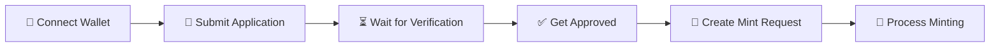

# 🔐 Secure Mint Vault

> **Whitelist Privately, Mint Securely**

A cutting-edge, privacy-preserving NFT whitelist and minting platform powered by **FHE (Fully Homomorphic Encryption)** technology. Experience the future of secure Web3 interactions where your data remains private while ensuring fair access to premium NFT drops.

## ✨ Core Features

### 🛡️ **Privacy-First Architecture**
- **End-to-End Encrypted** data transmission and storage
- **FHE Technology** ensures computations on encrypted data
- **Zero-Knowledge** verification system
- **Private Data** protection throughout the entire process

### 🔗 **Seamless Web3 Integration**
- **Multi-Wallet Support** via RainbowKit integration
- **Network Flexibility** with Sepolia testnet support
- **Real-time Status** tracking and updates
- **Gas-Optimized** smart contract interactions

### 🎯 **Advanced Whitelist Management**
- **Encrypted Applications** with secure submission
- **Verification System** with role-based access control
- **Fair Access Distribution** algorithm
- **Reputation Tracking** with encrypted scoring

### ⚡ **Modern User Experience**
- **Cyberpunk-Inspired** UI with neon accents
- **Responsive Design** for all devices
- **Real-time Feedback** and status updates
- **Accessibility-First** approach

## 🚀 Technology Stack

<table>
<tr>
<td align="center" width="33%">

### 🎨 **Frontend**
- **React 18** + TypeScript
- **Vite** build system
- **Tailwind CSS** styling
- **shadcn/ui** components

</td>
<td align="center" width="33%">

### ⛓️ **Web3 & Blockchain**
- **RainbowKit** wallet integration
- **Wagmi** + **Viem** hooks
- **Sepolia Testnet** deployment
- **Ethereum** ecosystem

</td>
<td align="center" width="33%">

### 🔐 **Security & Encryption**
- **Zama FHE** technology
- **Solidity** smart contracts
- **End-to-End** encryption
- **Privacy-Preserving** computations

</td>
</tr>
</table>

## 🚀 Quick Start

### 📋 Prerequisites

| Requirement | Version | Purpose |
|-------------|---------|---------|
| **Node.js** | 18+ | Runtime environment |
| **npm** | Latest | Package manager |
| **Git** | Latest | Version control |
| **Web3 Wallet** | Any | MetaMask, Rainbow, etc. |

### ⚡ Installation

```bash
# 1️⃣ Clone the repository
git clone https://github.com/BlocknetLabs/secure-mint-vault.git
cd secure-mint-vault

# 2️⃣ Install dependencies
npm install

# 3️⃣ Configure environment
cp env.example .env.local
# Edit .env.local with your settings

# 4️⃣ Start development server
npm run dev

# 5️⃣ Open in browser
# http://localhost:5173
```

### 🎯 First Steps

1. **Connect Wallet** - Link your Web3 wallet to the platform
2. **Submit Application** - Fill out the encrypted whitelist form
3. **Wait for Verification** - Your application will be reviewed
4. **Mint Tokens** - Once approved, request your NFT minting

## ⚙️ Environment Configuration

Create a `.env.local` file with the following variables:

```env
# 🌐 Chain Configuration
NEXT_PUBLIC_CHAIN_ID=11155111
NEXT_PUBLIC_RPC_URL=https://sepolia.infura.io/v3/YOUR_INFURA_KEY

# 🔗 Wallet Connect Configuration
NEXT_PUBLIC_WALLET_CONNECT_PROJECT_ID=YOUR_PROJECT_ID

# 📋 Contract Configuration (Update after deployment)
NEXT_PUBLIC_CONTRACT_ADDRESS=YOUR_CONTRACT_ADDRESS
NEXT_PUBLIC_VERIFIER_ADDRESS=YOUR_VERIFIER_ADDRESS
NEXT_PUBLIC_TREASURY_ADDRESS=YOUR_TREASURY_ADDRESS
```

> **⚠️ Security Note**: Never commit sensitive keys to version control. Use environment variables for all configuration.

## 📜 Smart Contract Architecture

The project includes a comprehensive Solidity smart contract (`contracts/SecureMintVault.sol`) with advanced privacy features:

### 🔐 **Core Functionality**
- **Encrypted Whitelist Management** - Secure entry processing
- **Mint Request Processing** - Privacy-preserving token minting
- **User Reputation System** - Encrypted scoring mechanism
- **Treasury Management** - Secure fund handling
- **Emergency Controls** - Safety mechanisms

### 🛡️ **Security Features**

| Feature | Description | Benefit |
|---------|-------------|---------|
| **FHE Integration** | Zama's FHE technology | Computations on encrypted data |
| **Access Control** | Role-based permissions | Secure multi-user system |
| **Privacy Preservation** | On-chain encryption | Data remains private |
| **Gas Optimization** | Efficient patterns | Cost-effective operations |

## 🎮 User Journey

### Step-by-Step Process



### 📋 **Detailed Workflow**

1. **🔗 Connect Wallet** - Link your Web3 wallet using RainbowKit
2. **📝 Submit Application** - Fill out the encrypted whitelist form
3. **⏳ Wait for Verification** - Your application is reviewed by verifiers
4. **✅ Get Approved** - Receive confirmation of whitelist status
5. **🎯 Create Mint Request** - Request token minting once approved
6. **🚀 Process Minting** - Approved requests are processed automatically

## 🛠️ Development

### 📜 Available Scripts

| Command | Description | Usage |
|---------|-------------|-------|
| `npm run dev` | Start development server | Local development |
| `npm run build` | Build for production | Deployment preparation |
| `npm run preview` | Preview production build | Testing before deploy |
| `npm run lint` | Run ESLint | Code quality check |

### 📁 Project Structure

```
secure-mint-vault/
├── 📁 contracts/              # Smart contracts
│   └── SecureMintVault.sol   # FHE-enabled contract
├── 📁 src/
│   ├── 📁 components/         # React components
│   │   ├── 📁 ui/            # shadcn/ui components
│   │   ├── WalletConnector.tsx
│   │   ├── WhitelistForm.tsx
│   │   └── WhitelistStatus.tsx
│   ├── 📁 hooks/             # Custom React hooks
│   ├── 📁 lib/               # Utilities & configurations
│   ├── 📁 pages/             # Page components
│   └── App.tsx               # Main application
├── 📁 public/                # Static assets
│   ├── favicon.ico           # Browser icon
│   └── favicon.svg           # SVG icon
└── 📄 Configuration files
```

## 🔒 Security & Privacy

This project implements multiple layers of security and privacy protection:

### 🛡️ **Security Layers**

| Layer | Technology | Purpose |
|-------|------------|---------|
| **FHE Encryption** | Zama FHE | Computations on encrypted data |
| **Access Controls** | Role-based | Secure multi-user permissions |
| **Input Validation** | Multi-layer | Frontend + smart contract validation |
| **Secure Communication** | HTTPS/WSS | Encrypted blockchain interactions |

### 🔐 **Privacy Features**

- **Zero-Knowledge Verification** - Prove without revealing
- **Encrypted Storage** - All sensitive data encrypted on-chain
- **Private Computations** - FHE enables private data processing
- **Secure Transmission** - End-to-end encrypted communications

## 🤝 Contributing

We welcome contributions! Here's how to get started:

```bash
# 1️⃣ Fork the repository
# 2️⃣ Create a feature branch
git checkout -b feature/amazing-feature

# 3️⃣ Make your changes
# 4️⃣ Commit with a clear message
git commit -m 'Add amazing feature'

# 5️⃣ Push to your fork
git push origin feature/amazing-feature

# 6️⃣ Open a Pull Request
```

### 📋 **Contribution Guidelines**

- Follow the existing code style
- Add tests for new features
- Update documentation as needed
- Ensure all checks pass

## 📄 License

This project is licensed under the **MIT License** - see the [LICENSE](LICENSE) file for details.

## 🆘 Support & Community

### 📞 **Get Help**

- **🐛 Bug Reports**: [GitHub Issues](https://github.com/BlocknetLabs/secure-mint-vault/issues)
- **💬 Discussions**: [GitHub Discussions](https://github.com/BlocknetLabs/secure-mint-vault/discussions)
- **📖 Documentation**: Check the docs in this repository

### 🙏 **Acknowledgments**

| Project | Purpose | Link |
|---------|---------|------|
| **Zama** | FHE technology | [zama.ai](https://zama.ai/) |
| **RainbowKit** | Wallet integration | [rainbowkit.com](https://rainbowkit.com/) |
| **shadcn/ui** | UI components | [ui.shadcn.com](https://ui.shadcn.com/) |
| **Vite** | Build tooling | [vitejs.dev](https://vitejs.dev/) |

---

<div align="center">

**🔐 Secure Mint Vault** - *Privacy-First NFT Platform*

[](https://vercel.com/new/clone?repository-url=https://github.com/BlocknetLabs/secure-mint-vault)

*Built with ❤️ by [BlocknetLabs](https://github.com/BlocknetLabs)*

</div>
